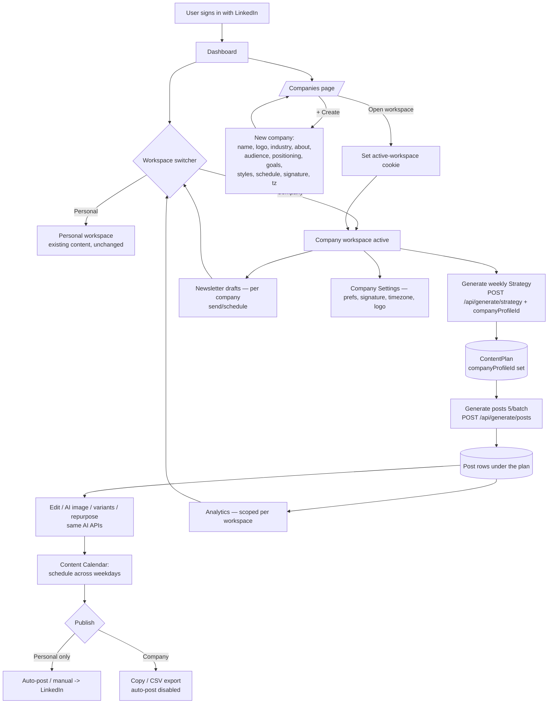
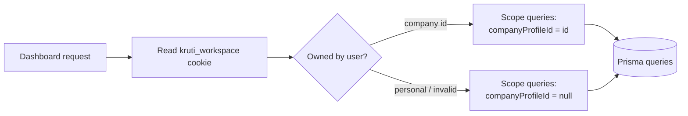

# Company Profiles — Workflow & Architecture

Kruti.io lets a user run multiple **company / brand workspaces** from one account.
Each company profile is an isolated content workspace with its own strategy,
posts, AI images, calendar, newsletters, analytics and settings — generated in
that company's voice. The user's own content lives in a default **Personal**
workspace (unchanged, fully backward-compatible).

> Decisions in effect:
> - **Content + image generation** for companies uses the **same AI APIs** as the user (temporary).
> - **Auto-posting to LinkedIn runs for the Personal workspace only.** Company posts are
>   draft/manage/export only until LinkedIn's Community Management API (org posting) is approved.
> - **Post quota** (30 / billing cycle) is **shared account-wide** across all workspaces.
> - One **subscription per account** (billing stays at the user level).

---

## High-level workflow



---

## How scoping works

Every piece of content is tied to a **workspace**:

- `ContentPlan.companyProfileId` — `null` = Personal, set = a company.
- `Post` belongs to a `ContentPlan` (inherits the workspace).
- `Newsletter.companyProfileId` — `null` = Personal, set = a company.

The **active workspace** is stored in an HTTP-only cookie (`kruti_workspace`),
always re-verified against the DB so it can only resolve to a workspace the
signed-in user owns.



---

## Data model (added)

```
CompanyProfile
  id, userId (owner)
  name, tagline, about, industry, website, logoUrl
  tonePrefs, positioning, contentGoals, contentStyles, targetAudience
  humanMode, postingSchedule, postSignature, timezone
  linkedinOrgId        # future: company-page posting
  onboardingCompleted
  contentPlans[]  newsletters[]

ContentPlan.companyProfileId  -> CompanyProfile?   (null = Personal)
Newsletter.companyProfileId   -> CompanyProfile?   (null = Personal)
```

Subscription, Account (LinkedIn token), rate-limits and auth remain **user-level**.

---

## Publishing rules (current phase)

| Workspace | Generate content & images | Auto-post to LinkedIn | Manual publish |
|-----------|---------------------------|-----------------------|----------------|
| Personal  | ✅ (existing)             | ✅ (existing)         | ✅             |
| Company   | ✅ (same AI APIs)         | 🚫 disabled           | Copy / CSV export |

Real LinkedIn **Company Page** posting will be enabled later via
`CompanyProfile.linkedinOrgId` + the `w_organization_social` scope once LinkedIn
approves the app for the Community Management API.
